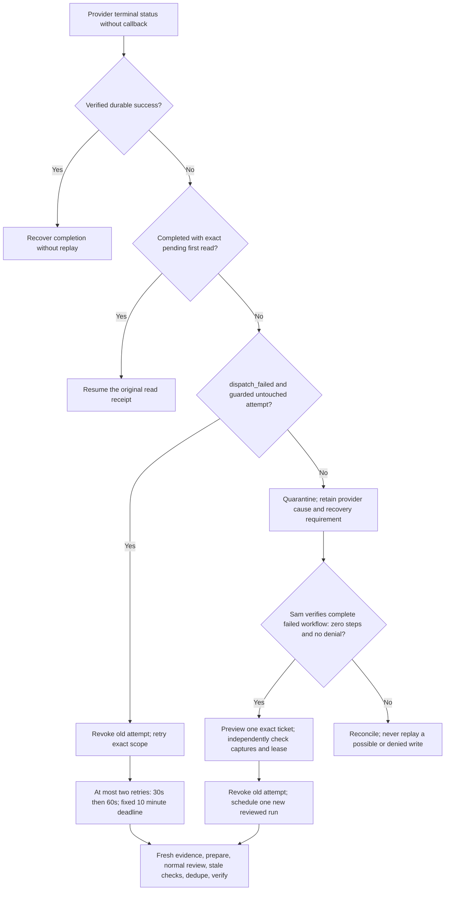

# Failed Agent startup recovery

Ticket 63964 was accepted by the provider, then failed with `run_failed` before
the saved workflow recorded any steps. The coordinator received no callback and
quarantined the original window. Production matched Git; the pending-first-read
fix did not apply because there was no pending read and the provider was failed.
The provider's internal cause remains unavailable.

## Recovery decision

The documented status API exposes `dispatch_failed` and `run_failed`, but does
not provide the Agent response or its workflow steps. We conservatively treat
only `dispatch_failed` as an automatic pre-execution recovery category. A generic
`run_failed` cannot be promoted by empty diagnostic captures or a missing ledger
record. Its complete saved conversation needs operator inspection. See the
[Workspace Agents API](https://developers.openai.com/workspace-agents/trigger-runs).

## Implementation

1. Add a mandatory, content-free MCP work-start acknowledgement for every
   correlated automatic tool call, independently of fail-open captures. Persist
   it before executing the tool. A revoked/expired/mismatched attempt fails
   closed. Manual calls and existing receipt reconciliation retain their paths.
2. Retry only authenticated provider `dispatch_failed`, HTTP 200, with the new
   guard armed and no work-start, query, read receipt, intent, write check,
   operation, rejected callback or candidate outcome. Prior active/suspended
   status also prevents this retry. Persist revocation, retry count and the
   original deadline before the next wake. Never set a SuperOps throttle gate.
3. Expose Sam-only Access recovery for historical `run_failed`/`dispatch_failed`
   orphans. Require explicit complete-workflow inspection attestation: zero
   steps, zero tool calls and elicitations, retryable provider execution failure,
   no denial. Also require complete zero-record/no-gap diagnostic captures and
   independent coordinator absence of intent/write/operation/query/work. These
   diagnostics corroborate the operator proof; they are not authorization.
   Preview must be read-only. Schedule once per source failure and exact ticket;
   preserve the original attention fence and created-time window, revoke the
   original lease and start a new batch through normal review.
4. Record bounded cause and blocked/exhausted recovery events. Do not store
   customer content, credentials or raw provider messages. Do not restart the
   paused monitor or change the Agent identity, permissions or instruction set.

## Validation and release

Use synthetic tests against the actual coordinator module for the observed
generic failure, pre-dispatch retry, cap/deadline persistence, late old tools,
denial/write/query/intent blockers, unavailable guard, one-ticket recovery,
duplicate recovery, authentication and private response headers. Test the MCP
wrapper's acknowledgement before execution and its fail-closed behavior. Run
both test suites/builds and `git diff --check` before committing and pushing.

Back up current modules/settings/deployments and compare stable bindings. Publish
only through the Git-connected pipeline. Verify both live modules and 100%
traffic; deployment order cannot grant a retry until the MCP advertises the new
guard. Then use read-only smoke tools and fresh 63964 metadata. Preview its exact
recovery before scheduling. Track the automatic run, callback and durable
operation, then independently confirm classification and a single private triage
note. Staff changes are accepted and protected by current identity/stale checks;
they are not a reason to bypass a fence.

Rollback is a normal Git revert/push disabling the new recovery flags first;
never reset coordinator/ledger state or replay outstanding writes. A successful
test proves the recovery path, not that provider errors or unrelated failure
patterns have been eliminated.

## Closure-option omission found during the live recovery

The inspected recovery reached MCP tools in batch 3693. Attempts 1 and 2
returned successful field metadata, but the Agent omitted `cause` in the first
lookup and both `cause` and `resolutionCode` in the second. Both stopped before
prepare or apply with `missing_field_options`. Complete private captures had no
gaps. Attempt 3 requested both closure fields and reached the reviewed durable
apply operation.

For correlated automatic triage, include `cause` and `resolutionCode` alongside
the requested fields in the same bounded metadata query. Manual subset lookups
retain their behavior. Missing upstream options remain empty; prepare/apply
validation still refuses invalid or unavailable values. Regressions cover the
two observed omissions, manual context isolation, missing upstream options and
invalid input without any mutation.

## Verified outcome at 2026-10-10 08:42 UTC

The reviewed startup recovery was scheduled once, preserving the original
one-ticket scope and revoking the old attempt. Batch 3693 attempt 3 reached
normal prepare/review/apply. Its original durable operation is Completed with
one successful verified item, no pending/failed/partial/unresolved-ambiguous
items and no human reconciliation requirement. Continuations resumed existing
receipts and completed classification, note and resolution verification.

An independent safe ticket read confirms 63964 is Resolved, has its
classification and closure fields populated, and has exactly one private
TRIAGE SUMMARY note. Notes retrieval was available and untruncated. The pending
independent display-number read resumed its original dispatcher receipt.

Both Workers are live at 100% traffic. The downloaded MCP module contains the
new start guard and automatic closure-field expansion; the coordinator module
matches its reviewed source SHA-256. Durable bindings and secret names match
the pre-change backup. The paused monitor was not resumed.

Validation passed: 851 MCP Vitest tests, three instruction serialization tests,
policy checksum validation, 155 actual coordinator runtime tests, the coordinator
Miniflare verifier, both builds and `git diff --check`. These checks establish
this recovery and the implemented safeguards; they do not prove all historical
failure patterns eliminated. Generic provider `run_failed` still requires the
complete-workflow inspection described above, because the status API does not
expose the proof needed for an automatic safe retry.
